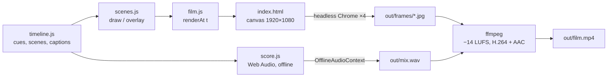

# 3 · Path B: draw every frame with code

An AI assistant (Claude, in these projects) writes a program that **draws** the film, and a browser renders it frame by frame. Use this path for **explainers, data, maths, science, timelines, titles and motion graphics**: anything where the picture is shapes, light, text and numbers rather than people.

What you get in return: every frame is exact and repeatable, text is always spelled right, a change is one edit plus a re-render, and rendering costs nothing.

The runnable version of everything below is in [`starter/`](../starter/README.md).

## The one idea: a film is `render(t)`

```js
// Same t in, same picture out.
export function renderAt(t) {
  drawBackground(t);
  for (const scene of activeScenes(t)) scene.draw(ctx, t);
  drawCaptions(t);
}
```

If a frame depends only on the time `t`, and never on the previous frame, the clock or `Math.random()`, then:

- any frame can be rendered on its own, so **4 browsers can render in parallel**,
- a crashed render **resumes** where it stopped (finished frames are skipped),
- you can **scrub** to any moment in a normal browser while editing,
- the assistant can **check its own work** by rendering a few stills and looking at them.

## How the pieces connect



`timeline.js` is the single source of truth: when a cue moves there, the picture, the captions and the sound all move together. In the starter, the soundtrack rings a bell at the exact moment the seed count on screen passes each Fibonacci number, because both read the same function.

## Rules for frame-pure code

1. **No `Math.random()`.** Use a seeded generator (`rng(seed)` in `starter/src/lib.js`).
2. **No clock.** Nothing in drawing code may read `Date.now()` or `performance.now()`.
3. **No memory between frames.** If something needs a simulation (particles settling, a growth process), **precompute** it once at load time, or offline into a JSON file, and look it up by `t`.
4. **All timing comes from the timeline.** Scenes take `t` and their own window `{ a, b, lt }`; they never hard-code absolute seconds.
5. **Wait for fonts.** `await document.fonts.load(...)` before the first frame, or the first frames render in a fallback font.

## Working with the assistant

The loop that produced the films in [`examples/`](../examples/README.md):

1. **Brief** ([template](../templates/brief.md)). Give the length, aspect ratio, language, tone and references. Ask for a **storyboard first**, with no code yet.
2. **Storyboard review.** Read the shot table and change it now; it's the cheapest moment to change anything.
3. **Build act by act.** After each scene, the assistant renders a **contact sheet** (`node render.mjs --range=40:66:1`) and looks at it before moving on. Ask to see the sheets too.
4. **Full render** (`npm run build`), then watch it once yourself, with sound.
5. **Notes → fixes.** Give notes with timestamps ("at 0:42 the caption covers the chart"); a fix is an edit and a re-render of only the affected range.

Good things to ask for explicitly: *"every fact on screen must be correct; list your sources"*, *"the music must follow the picture's cues from the timeline"*, *"no text smaller than 28 px at 1080p"*, *"check each act with a contact sheet before continuing"*.

## Performance

These numbers are from a 4-core machine with **no GPU**. Chrome falls back to software rendering (SwiftShader):

| Film | Effective time per 1080p frame (4 workers) | Full render |
|---|---|---|
| `starter/` (15 s, 610 glowing dots) | ~40 ms | ~20 s frames + ~40 s encode |
| *137.5°* (2:30, up to 1,500 seeds + bloom) | ~45 ms | a few minutes |

What costs the most: `ctx.filter = 'blur()'` and `shadowBlur` at full resolution. Blur a **quarter-size copy** instead and add it back with `'lighter'` (that's how the glow in the starter works). Draw many small soft dots as radial-gradient squares, not `shadowBlur` circles.

## Sound in code

`score.js` builds the whole soundtrack in an `OfflineAudioContext` (faster than real time, sample-exact) and saves it as WAV: pads from detuned sawtooth waves, bells from FM synthesis, risers from filtered noise, reverb from a generated impulse response. Two traps:

- **A new `GainNode` starts at gain 1.** Set `gain.value = 0` before scheduling an envelope, or every note starts with a click.
- **Don't master with `DynamicsCompressorNode`.** Chrome's compressor adds automatic make-up gain, so levels jump around. Leave headroom in the mix and master in ffmpeg (gain, then a limiter at 4× sample rate). `render.mjs --encode` does this.

## Text and fonts

- Ship fonts with the project (`starter/fonts/`), with their licences. Don't rely on system fonts; the render machine may not have them.
- **Chinese, Japanese and Korean fonts are huge.** Subset them to only the characters you use with the Google Fonts `&text=` parameter, e.g. `https://fonts.googleapis.com/css2?family=Noto+Serif+SC:wght@600&text=熵一个角度`, and re-subset whenever the captions change.

## Other engines

The same idea exists in many tools. Pick one the assistant can drive from the command line:

| Tool | Language | Notes |
|---|---|---|
| This repo's `starter/` | JavaScript + Canvas 2D | No framework, about 500 lines in all, easy for an assistant to read whole |
| Remotion | React | Video as React components; large ecosystem |
| Motion Canvas / Revideo | TypeScript | Animation timelines with generators |
| Manim | Python | Built for maths explainers |
| Python + Playwright + ffmpeg | Python | What [*The History of AI in 120 seconds*](https://github.com/carljings/ai-history-video) uses |
