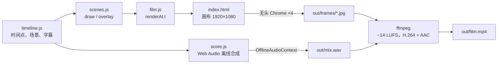

# 3 · 路线 B：用代码画出每一帧

[English](../03-path-b-code.md) · **简体中文**

由 AI 助手（在这些项目里是 Claude）写一个程序来**画**出整部片子，再由浏览器一帧一帧地渲染。这条路线适合**科普讲解、数据、数学、科学、时间线、片头字幕和动态图形**：画面是形状、光、文字和数字，而不是真人。

换来的是：每一帧都精确、可复现，文字永远不会写错，改一处只要改代码再渲染一次，渲染本身不花钱。

下面讲的内容，可直接运行的版本在 [`starter/`](../../starter/README.zh-CN.md)。

## 核心思想：一部片子就是 `render(t)`

```js
// 同一个 t 进去，同一张画面出来。
export function renderAt(t) {
  drawBackground(t);
  for (const scene of activeScenes(t)) scene.draw(ctx, t);
  drawCaptions(t);
}
```

如果每一帧只取决于时间 `t`，而不取决于上一帧、时钟或 `Math.random()`，那么：

- 任何一帧都能单独渲染，所以**可以开 4 个浏览器并行渲染**；
- 渲染中断后能**从断点继续**（已完成的帧会跳过）；
- 编辑时可以在普通浏览器里**拖到任意时刻**预览；
- AI 助手可以渲染几张静帧、自己看一看，从而**检查自己的成果**。

## 各部分如何连接



`timeline.js` 是唯一的事实来源：在这里移动一个时间点，画面、字幕和声音会一起移动。在入门短片里，屏幕上的种子数量每越过一个斐波那契数，配乐就在那一刻敲响一声钟，因为两者读的是同一个函数。

## 纯函数帧的规则

1. **不用 `Math.random()`。** 用带种子的随机数生成器（`starter/src/lib.js` 里的 `rng(seed)`）。
2. **不读时钟。** 绘制代码里不能读 `Date.now()` 或 `performance.now()`。
3. **帧与帧之间不保留状态。** 需要模拟的东西（粒子沉降、生长过程）在加载时**预先计算**，或者离线算好存成 JSON，再按 `t` 查表。
4. **所有时间都来自时间线。** 场景接收 `t` 和自己的时间窗 `{ a, b, lt }`，从不硬编码绝对秒数。
5. **等字体加载完。** 渲染第一帧前先 `await document.fonts.load(...)`，否则开头几帧会用回退字体。

## 和 AI 助手协作

[`examples/`](../../examples/README.zh-CN.md) 里的作品都是这样迭代出来的：

1. **简报**（[模板](../../templates/zh-CN/brief.md)）：给出时长、画幅、语言、基调和参考。要求它**先出分镜**，暂时不写代码。
2. **审分镜。** 读镜头表，现在就改；这是改动成本最低的时候。
3. **一幕一幕地做。** 每做完一个场景，AI 助手渲染一张**抽帧拼图**（`node render.mjs --range=40:66:1`），看过再继续。也让它把拼图给你看。
4. **完整渲染**（`npm run build`），然后你自己带声音完整看一遍。
5. **意见 → 修改。** 带时间码给意见（"0:42 字幕挡住了图表"）；修改就是改代码，再只重新渲染受影响的时间段。

值得明确提出的要求：*"屏幕上的每个事实都必须正确，列出来源"*、*"音乐必须跟随时间线上画面的节点"*、*"1080p 下文字不小于 28 像素"*、*"每一幕都先用抽帧拼图检查再继续"*。

## 性能

以下数据来自一台 4 核、**无 GPU** 的机器。Chrome 会退回软件渲染（SwiftShader）：

| 作品 | 每帧 1080p 的有效耗时（4 个并行进程） | 完整渲染 |
|---|---|---|
| `starter/`（15 秒，610 个发光点） | 约 40 毫秒 | 帧约 20 秒 + 编码约 40 秒 |
| *137.5°*（2 分 30 秒，最多 1,500 颗种子 + 辉光） | 约 45 毫秒 | 几分钟 |

最耗时的是全分辨率的 `ctx.filter = 'blur()'` 和 `shadowBlur`。改为对**四分之一尺寸的副本**做模糊，再用 `'lighter'` 叠加回来（入门短片的辉光就是这么做的）。大量柔和的小点用径向渐变的方块来画，不要用带 `shadowBlur` 的圆。

## 用代码做声音

`score.js` 在 `OfflineAudioContext` 里生成整条配乐（比实时快、采样级精确），保存为 WAV：铺底和弦来自失谐的锯齿波，钟声来自 FM 合成，上升音效来自滤波噪声，混响来自生成的冲激响应。两个坑：

- **新建的 `GainNode` 默认增益是 1。** 安排包络之前先把 `gain.value` 设为 0，否则每个音符开头都会有爆音。
- **不要用 `DynamicsCompressorNode` 做母带。** Chrome 的压缩器会自动补偿增益，音量会忽大忽小。混音时留足余量，在 ffmpeg 里做母带（先增益，再以 4 倍采样率限幅）。`render.mjs --encode` 就是这样做的。

## 文字与字体

- 字体随项目一起分发（`starter/fonts/`），连同许可证。不要依赖系统字体，渲染的机器上可能没有。
- **中日韩字体非常大。** 用 Google Fonts 的 `&text=` 参数只截取用到的字，例如 `https://fonts.googleapis.com/css2?family=Noto+Serif+SC:wght@600&text=熵一个角度`，字幕一改就重新截取。

## 其他引擎

同样的思路在很多工具里都有。选一个 AI 助手能从命令行驱动的：

| 工具 | 语言 | 说明 |
|---|---|---|
| 本仓库的 `starter/` | JavaScript + Canvas 2D | 不依赖框架，总共约 500 行，AI 助手可以一次读完 |
| Remotion | React | 把视频写成 React 组件；生态很大。示例：[光遗传学V3](../../output/optogenetics-film-v3/README.zh-CN.md)，每幕一块发光的 canvas，上面叠 React 文字和面板 |
| Motion Canvas / Revideo | TypeScript | 用生成器写动画时间线 |
| Manim | Python | 为数学讲解而生 |
| Python + Playwright + ffmpeg | Python | [*The History of AI in 120 seconds*](https://github.com/carljings/ai-history-video) 用的就是这一套 |
