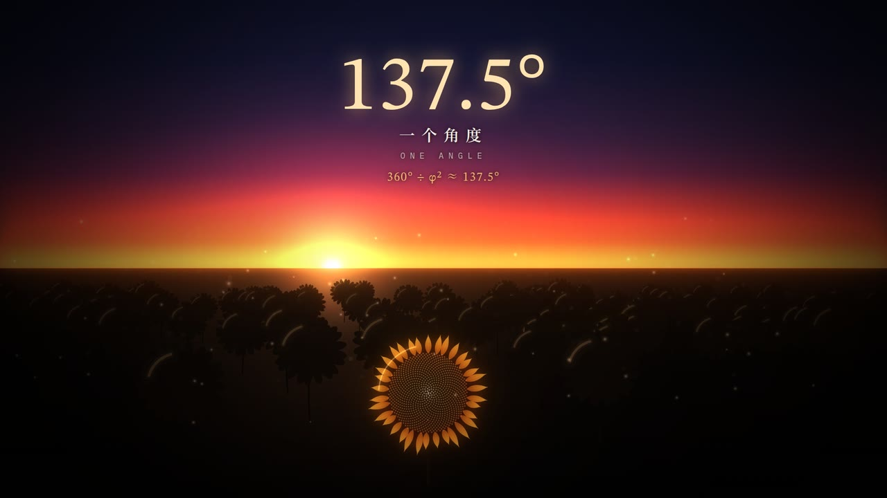

# 137.5° (source)

[](https://github.com/carljings/how-to-make-ai-video/releases/download/film-137.5/137.5.mp4)

An original 2:30 film about the golden angle: one rule that builds a sunflower, hides the Fibonacci numbers, refuses every other angle, appears in other plants, and is found by growth itself. Every frame is drawn by JavaScript on an HTML canvas and every sound is synthesized with Web Audio; no video-generation model, footage, photographs or samples are used.

| | |
|---|---|
| Film | [▶ `137.5.mp4`](https://github.com/carljings/how-to-make-ai-video/releases/download/film-137.5/137.5.mp4) (release [film-137.5](https://github.com/carljings/how-to-make-ai-video/releases/tag/film-137.5)) |
| Length | 2:30 (150 s) |
| Picture | 1920 × 1080, 30 fps, H.264 |
| Sound | AAC stereo 48 kHz, mastered to −14 LUFS |
| Subtitles | Burned in (Chinese and English) and in [`137.5.srt`](137.5.srt) |
| Plan | [`STORYBOARD.md`](STORYBOARD.md): the five acts, sound design and every fact shown |

## You can hear it

Each seed, scale, leaf and bud plays a note chosen by its angle (two octaves of C major pentatonic). When the head regrows at 90°, 120°, 144° or 138.46°, the notes fall into loops of 4, 3, 5 or 13 at the same moment the spokes appear. At 137.5° the melody never repeats. In Act V the simulated buds begin as an octave seesaw at 180° and drift into that same never-repeating melody as the angle settles.

## Reproduce

Requirements: Node.js 18 or newer, Google Chrome or Chromium, ffmpeg, about 1 GB of free disk.

```sh
npm install
node render.mjs --frames=0:150 --workers=4   # all 4,500 frames → out/frames (resumable)
node render.mjs --audio                       # soundtrack → out/mix.wav
node render.mjs --encode                      # master and mux → out/137.5.mp4
node render.mjs --srt                         # subtitles → out/137.5.srt
```

Preview while editing: `node render.mjs --serve`, then open <http://localhost:8123>. Contact sheet: `node render.mjs --range=50:66:1 --cols=4`.

## Map

| Path | What it is |
|---|---|
| [`src/timeline.js`](src/timeline.js) | Cues, the angle trials, scene windows, captions |
| [`src/flower.js`](src/flower.js) | The seed head (Vogel's model) and petals, shared by the close-ups and the field |
| [`src/scenes/head.js`](src/scenes/head.js) | Acts I–III: growth, arm counting, Fibonacci families, angle trials, bloom |
| [`src/scenes/math.js`](src/scenes/math.js) | Ratios closing in on φ, the split circle, the continued fraction |
| [`src/scenes/plants.js`](src/scenes/plants.js) | Pinecone, pineapple and rosette on surfaces of revolution |
| [`src/scenes/emerge.js`](src/scenes/emerge.js) | The bud simulation and its divergence chart |
| [`src/scenes/field.js`](src/scenes/field.js) | The dusk field and the title |
| [`src/score.js`](src/score.js) | The soundtrack, including all sonification |
| [`tools/emerge.mjs`](tools/emerge.mjs) | Precomputes the Douady–Couder style simulation → `assets/emerge.json` |
| [`tools/fonts.mjs`](tools/fonts.mjs) | Re-subsets the fonts after any text change |
| [`render.mjs`](render.mjs), [`index.html`](index.html), [`src/gfx.js`](src/gfx.js), [`src/text.js`](src/text.js), [`src/lib.js`](src/lib.js) | The rendering engine shared with the entropy remake |

See [`CREDITS.md`](CREDITS.md) for fonts and sources.
