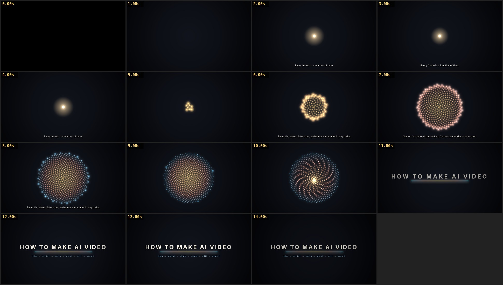

# Starter: a film drawn by code

A complete 15-second film (picture, music, titles): about 350 lines of JavaScript for the film, plus a 150-line renderer. Copy this folder to start your own.



## Build it

Requirements: Node.js 18+, Google Chrome or Chromium, ffmpeg.

```sh
npm install
npm run build          # frames → soundtrack → out/film.mp4  (about a minute on 4 CPU cores, no GPU)
```

Or step by step:

```sh
node render.mjs --serve                    # studio: scrub and play at http://localhost:8123
node render.mjs --range=0:15:1 --cols=4    # contact sheet, one frame per second → out/sheet.jpg
node render.mjs --frames --workers=4       # 450 frames → out/frames/ (resumable)
node render.mjs --audio                    # soundtrack → out/mix.wav
node render.mjs --encode                   # −14 LUFS master + H.264 → out/film.mp4
```

Set `CHROME_PATH` (or pass `--chrome=<path>`) if Chrome isn't in a standard place. Pass `--gpu` on a machine with a GPU.

## Files

| File | What it is | Edit it to… |
|---|---|---|
| [`src/timeline.js`](src/timeline.js) | Size, frame rate, length, cues, scene windows, captions | change timing, length, words |
| [`src/scenes.js`](src/scenes.js) | What each scene draws (`draw` = glowing light, `overlay` = crisp type) | change the pictures |
| [`src/film.js`](src/film.js) | Composes a frame: background → light → glow → type → vignette → fade | change the overall look |
| [`src/score.js`](src/score.js) | The soundtrack: pads, FM bells, a riser, a boom, timed from the timeline | change the music |
| [`src/lib.js`](src/lib.js) | Easing, keyframes, seeded random numbers | |
| [`index.html`](index.html) | The page: studio controls, plus the hooks `render.mjs` calls | |
| [`render.mjs`](render.mjs) | Drives headless Chrome, writes frames and audio, masters and encodes | |

## Make it yours

1. Write your [brief](../templates/brief.md) and [storyboard](../templates/storyboard.md).
2. Put the storyboard's times into `CUE`, `SCENES` and `CAPTIONS` in `timeline.js`.
3. Add one object per scene to `scenes.js` with `draw(ctx, t, s)` and/or `overlay(ctx, t, s)`, and list it in `SCENES`.
4. After every scene, render a contact sheet of its time range and look at it.
5. Change the chords and cues in `score.js`, then `npm run build`.

Keep every frame a pure function of `t`: no `Math.random()` (use `rng(seed)`), no clock, nothing carried over from the previous frame. See [Chapter 3](../docs/03-path-b-code.md) for why.

## Asking Claude to build on it

> Here is my brief: … Using the engine in `starter/`, write a storyboard first. After I approve it, build the film act by act; after each act, render a contact sheet with `node render.mjs --range=…` and check it before continuing. Every frame must stay a pure function of t.

Fonts: Inter and JetBrains Mono (SIL Open Font License; see `fonts/OFL-*.txt`).
